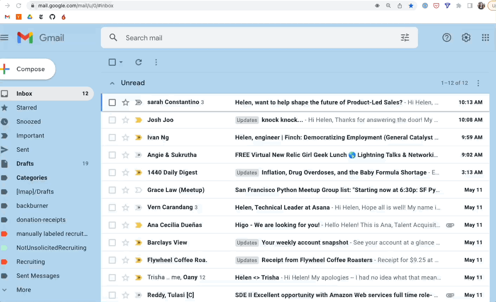

# Recruiter Filterer

Chrome extension that filters unsolicited tech recruiter emails by running an ML model whenever you open gmail. Everything runs in your browser, so your email content never leaves your device.

**WIP: the model is still trained on my name and company. More updates coming. I mostly made this for myself and to brush on up on javascript and play around with tensorflow.**

## Usage - Chrome Extension
Use my model and add this code as a chrome extension to filter recruiters from your inbox. TODO

## Usage - Train your own model
Use node.js to download your emails, train a simple gradient descent model to classify recruiting vs not, and use your own model in your chrome extension. TODO

## Developer notes
Built using node version 18.0.0. I've noticed some build issues using lower versions.